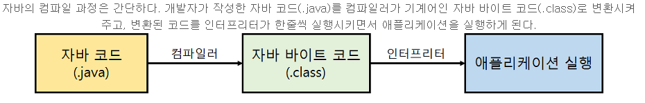
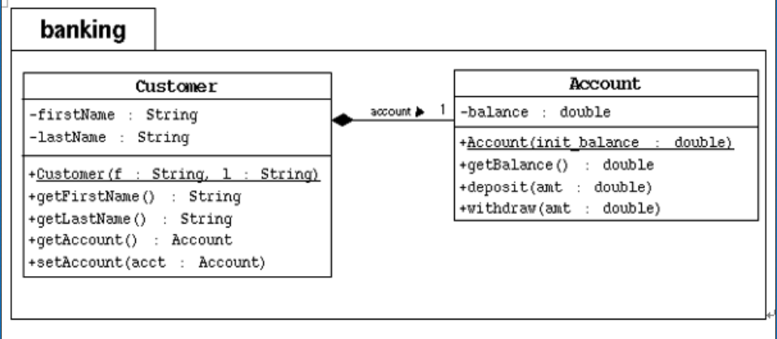
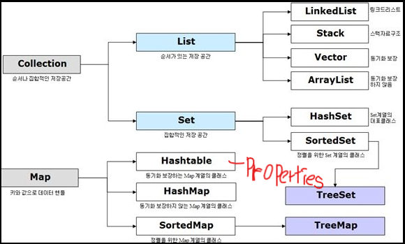
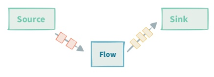
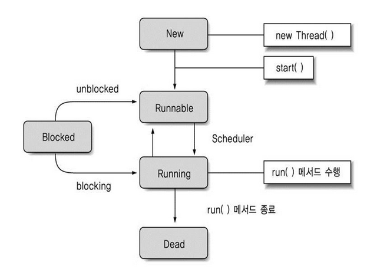
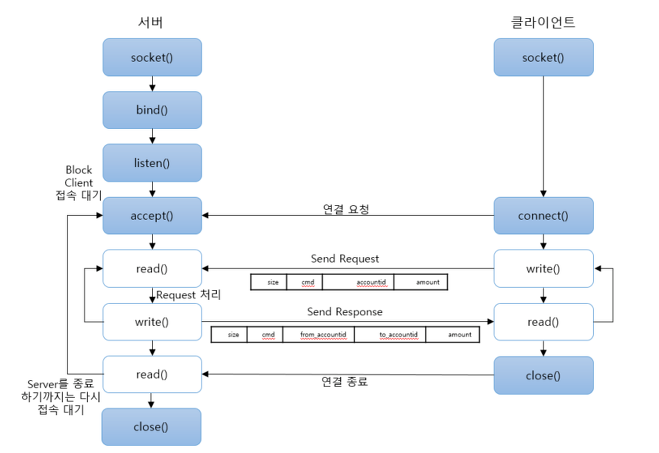
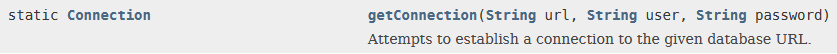
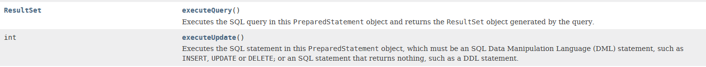
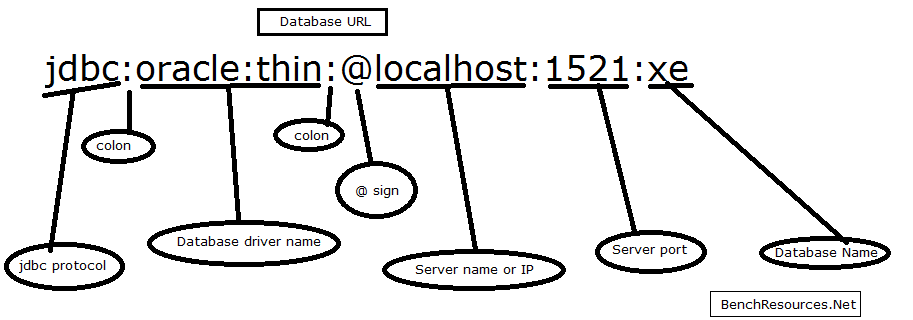
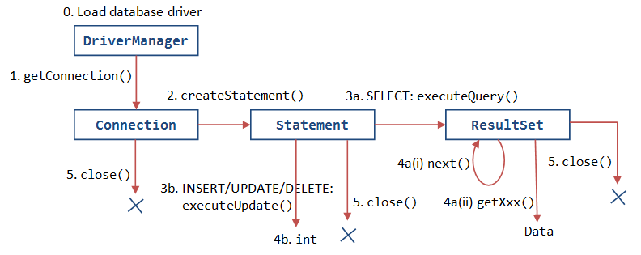

# 자바 (Java)

1. **Java SE 파일 경로**
    1. **OOP (Object Oriented Programing)**

        

        객체의 관계

        - 실 세계의 모든 것은 객체간의 상호작용에 의해 이루어진다는 개념
        - SW 시스템을 객체(Object) 단위로 구성되며, 객체들이 서로 관계성을 가지는 시스템
        - Abstraction(추상화)
            - 현상에 존재하는 객체 주요특징을 추출하는 과정
        - Encapsulation(캡슐화)
            - 하나의 클래스 안에 데이터와 기능을 담음
        - Inheritance(상속)
            - 객체 정의 시 기존에 존재하는 객체의 속성과 기능을 상속받아 정의
        - Polymorphism(다형성)
            - 같은 타입 또는 같은 기능의 호출로 다양한 효과를 가져오는 것

        ## 절차적 프로그래밍

        ---

        `실질적 실행 메소드(프로세스)` , `class(데이터)`

        절차적 프로그래밍이란 프로세스와 데이터를 별도의 모듈로 사용한다.

        → 의존성이 강해진다. → 수정이 힘들다. → 버그에 취약하다.

        ### resolution

        스스로 데이터를 처리 할 수 있도록한다.

        → `객체지향 프로그래밍`

    - `bin` : 컴파일러, 디버거, 실행파일이 들어있는 폴더
    - `src.zip` : Java API Source
    - `rt.jar` : 클래스 파일의 묶음

2. **Package**
    - java . lang . System
        - [FQCN(Fully Qualified Class Name)](https://www.notion.so/ffba74e7-04d4-49f0-b780-68332574a5e7)
        - lang (*package or directory*)
            - System (*class*)

        [Java Platform SE 8](https://docs.oracle.com/javase/8/docs/api/)

3. **Java Compile** 

    

1. Array(배열)
    - ***List of Same data type***
    - *Array can't resize*
    1. Stack array변수 할당
    2. Heap arr 변수 할당
    3. Heap 주소 할당
    4. Stack 주소 값에 Heap 주소 값 할당
    5. Stack의 주소 값으로 Heap 참조
2. 객체
    - 동일한 객체란?
        - 주소가 같은 객체
3. `Garbage Collector`
    - 하나의 Thread
    - 우선순위가 낮다.
    - `Static`으로 선언된 값은 `Heap` 공간 안에 들어가지 않는다.
        - 따라서 Garbage collector 검사 대상이 아니다.
4. 함수란 두가지 기능을 한다.
    - *Return*
    - *Call*
5. **SE 버전과 EE 버전**
    - 함수 호출의 대상이 바뀐다.
        - 기능이 늘어나면 모두 제어하기 힘들다.
6. **Call by value && Call by Reference**
    - 자바는 *Call by value*를 선택.
        - 파라미터 값으로 객체를 넘기면 그 객체의 주소가 넘어가
7. `This`
    - 필드명과 로컬변수의 이름이 같을때 구분하기 위해서 필드앞에 지정
        - 객체의 reference값을 가지고 있기 때문에
    - `this()`
        - 생성자 앞에 쓰이는 this
        - 하나의 클래스 내에서 또다른 생성자를 호출할때 사용
        - 

8. **의존성**

    

    - `Customer` 가 `Acoount`를 의존(*dependency*)한다.
- **정보를 저장하는 클래스**
    - *Domain (DO, Domain Object)*
    - *VO(Value Object)*
    - *DTO(Domain Transfer Object)*

### 수직적인 관계

---

소프트웨어는 수평적인 관계와, 수직적인 관계로 연결되어 있다.

- ***Hasing : 관계를 가지기 위해서 필드로 그 객체를 가져야한다.***

### 추상화(Abstract) 
일반화(Generalization) <—> *구체화(Specialization)*

---

공통적인 성질을 추출해서 그 성질을 일반적인 특성으로 가지는 모듈을 하나.

### `super();`

---

    public Manager(String name, double salary, MyDate birthDate, String dept) {
    //		super();	 부모 기본 생성자 호출
    		this.name = name;
    		this.salary = salary;
    		this.birthDate = birthDate;
    		this.dept = dept;
    	}

`super()`를 호출하지 않아도 자동으로 호출된다.

**상속 받은 클래스는 메모리에 올라갈때 부모클래스가 아니더라도 함께 메모리에 올라간다.** 

자식을 생산한다. → 부모가 만들어진다. 

### Method Overriding (메소드 재정의)

---

상속관계에 있는 두 클래스에서 적용되는 원리

- 부모가 가진 기능을 물려받고 그것을 자식이 다시 고쳐쓰는 것

### Rule

메소드 선언부는 모두 일치 (리턴타입, 이름, 인자값) → 접근 지정자

메소드 구현부는 반드시 달라야한다. (순서, 타입, 갯수중 하나라도 달라야한다.)

**More modifier / Less Exception**

*parent*

    public void eat(String kind, String num)
    void go()

*child*

    void eat(String kind, String num) //  x 
    public void eat(String kind, String num)
    public void go() {  // ok

### Object method

---

`Test t = new Test();`에서의 `new Test`는 **참조변수.**

**참조변수**뒤에는 `toString()`이 생략되어있다.

### 접근지정자 Access Modifier

---

public , protected , private 

protected는 상속이 되어있을때 public이 된다.

### `this` && `super` 사용법

---

1. **`super()`와 `this()`생성자는 함께 사용할 수 없다?**

    ### 해결

    - 생성자는 클래스의 생성시에 단 한번만 호출되며, 객체의 초기화를 담당한다.
    - `super()`는 항상 가장 첫줄에 제시되어있다. ( 명시하지 않았다면 생략되어있음 )

    ### IF

    - `this()`생성자 호출을 통해서 해당 생성자에서  다른 생성자로 이동하면 그곳에 super() 메소드가 생략되어 있다. 따라서, `super()` 생성자는 항상 가장 첫줄에 제시되어있다.

생성자는 메소드가 아니다!!

`this`는 **실행되고있는 객체의 레퍼런스를 가지고있다.**

# Overroading

---

메소드 하는 일은 같고 처리하는 데이터를 달리할때 쓰이는 기법

### 조건

- 메서드의 **이름**이 같아야 한다.
- 메서드의 **리턴타입**이 다른 경우는 오버로딩이 성립되지 않는다.
- 매개변수의 개수 or 매개변수의 자료형이 달라야 한다.

### 참고자료

[생성자(Constructor)도 메소드인가?](https://javacan.tistory.com/entry/37)

# 상속(Polymorphism = Poly+Morphism)

---

하나의 객체변수가 여러개의 모습과 모양을 갖는 능력

부모타입의 변수로 다양한 자식객체를 생성하는 것

- Virtual Method Invocation 원리
    - **부모가 가지고 있는 메소드를 자식이 오버라이딩하고 있으면 자식의 함수를 호출한다.**

        class Super
        {	
        	public void show()
        	{
        		System.out.println("C");
        	}
        	public void up()	
        	{
        		this.show(); // 현재 this는 Sub의 레퍼런스 주소를 가지고 있다.
        		System.out.println("B");
        	}
        }
        class Sub extends Super
        {
        	public void show()
        	{
        		System.out.println("D");
        	}
        	public void down()	
        	{
        		super.up();
        		System.out.println("A");
        	}
        }
        public class Calculate{
        	public static void main(String[] args){
        		Super s = new Sub();
        		((Sub)s).down();
        	}
        }
        ----------------실행 결과-------------------
        |                   D                      |
        |                   B                      |
        |                   A                      |
        --------------------------------------------

- Object Casting

        Parent p = new Chlid();
        ((Child)p).down();   // 자식에게만 있는 메소드를 사용할 경우 Object casting을 해줘야 한다.

- Instanceof

    instanceof는 객체타입을 확인하는데 사용.

    속성은 연산자이고 형변환이 가능한 지 해당 여부를 true 또는 false로 가르쳐준다.

    비교하는 값이 부모일 경우 자식까지 같이 `True`값으로 리턴한다.

    ## 사용형식

    객체 + instanceof + 클래스

    A를 부모, B를 자식 클래스로 세팅하고 두 클래스 간 현변환이 가능한지 확인.

        class A{}
        
        class B extends A{}
        
        class instanceofEx01 {
        
        public static void main(String[] args) {
        
        A a = new A();
        
        B b = new B();
        
        System.out.println("a instanceof A : " + (a instanceof A));
        
        System.out.println("b instanceof A : " + (b instanceof A));
        
        System.out.println("a instanceof B : " + (a instanceof B));
        
        System.out.println("b instanceof B : " + (b instanceof B));
        
        <결과>
        
        a instanceof A : true
        
        b instanceof A : true
        
        a instanceof B : false
        
        b instanceof B : true

# 리턴(Return)의 중요성

---

클라이언트의 요청 하나당 서버 사이드의 메소드로 응답한다.

# 다형성

---

한 타입의 참조변수로 여러 타입의 객체를 참조할 수 있도록 함.

부모클래스 타입의 참조변수로 자식클래스의 인스턴스를 참조할 수 있다.

    class A
    {
         public String x() {
              return "x";
         }
    }
    class B extends A // class A를 상속받고 있는 class B
    {
         public String y() {
              return "y";
         }
    }
    
    public class Main
    {
         public static void main(String[] args){
              A obj = new B();
              obj.x();
              obj.y(); // 이 녀석으로 인해 컴파일 에러 , Object casting 필요!!
         }
    }

### 참고자료

[[JAVA] 9. 다형성 / 객체지향적 이해, 다형성과 클래스, 다형성과 인터페이스](https://asfirstalways.tistory.com/168)

# Static

---

1. static한 성질을 가지는 맴버는 객체생성 과정이 필요없다.
    - 객체생성 하지 않아도 메모리에 올라간다.
    - 객체생성 이전에 미리 메모리 올라간다.
    ( class file loader 과정에서 메모리에 올라간다 )
    - static 블락 안에서는 절대로 this 사용을 못한다.
2. static은 static끼리 접근가능.
3. static은 local level로는 사용 불가. → 필드 level로만 사용 가능
4. static변수, 클래스변수라 불린다. 

    // 아래는 모두 static 메소드
    Math.abs();
    Integer.parseInt();
    String.format()
    System.in

1. static 변수는 생성된 객체들에서 모두 공유한다.
2. static은 메모리를 한번에 올리기 때문에 순서와는 선언 순서와는 상관이 없다.

# Interface

---

기능의 Template만을 모아놓은 틀 ( **추상 메소드** ) 

## 구성요소

- 구현부가 없는 ( ; ) 추상메소드

    → `public abstract`가 항상 생략

## 조건

- **필드를 가지지 않는다**

    → 필드를 선언한다면 `public static final`이 무조건 생략된다.

- 클래스에서 인터페이스를 사용할 때, **인터페이스의 메소드 중에서 하나라도 구현 안된 메소드가 있으면 추상 클래스**가 된다.

## 추상클래스(Abstract)

---

부모로써 성질만을 자식들에게 물려준다.

### interface VS abstract

`interface` : 기능

`abstract` :  상속의 대상

    			Dog  extends    Animal
    			Bird implements Flyer
    Attackable extends    Movable

### 추상클래스의 용도

1. 여러 종류의 피자를 만들때 피자가 가지는 공통적인 성질은 그대로 물려준다.
2. 여러 종류의 피자를 만들때 서로 다른 피자가 만들어지는 결정적인 부분은 구멍(추상메소드)으로 물려준다.

# Collection

---

가장 원시적인 방법으로 자료를 저장 ( 중복 O , 순서 X )

**`Java 진영에서 properties는 엄청 중요하고, properties는 <key,value>를 String 타입만 가진다.`**

## Iterator

**객체를 iterator로 변환해서 반환**
Iterator는 커서를 이용해서 컬렉션의 모든 데이터를 순차적으로 접근해서 Sorting한다.
Collection 뷰 역할을 한다.

### ListIterator

- 양반향 검색이 가능

# Exception

---

---

## RuntimeException

(컴파일러가 인식 못함) 

- 컴파일이 된다.
- 코드를 수정하면 된다.

## CompileException

(컴파일러가 인식 함) **JVM 처리 : main에서 throws 가능**

- 컴파일에서 바로 에러
- 명시적처리가 필요

## 예외처리 방법

### 예외를 직접 처리

    try{
       // 예외발생 코드
    }catch(발생한 예외 객체){
    	// 예외잡힐 경우의 코드
    }finally{ // 예외와 상관없이 항상 수행되는 코드
    	try{
    	}catch(Execption e){
    	}
    }

### 예외를 던짐 → JVM 처리

    public static void main(String[] args) throws FileNotFoundException, IOException {
    try{
    	// 예외발생 코드
    }finally{
    	// 반드시 처리해야할 코드
    }

## 사용자정의 예외(User Exception)

1. 기존의 라이브러리 클래스를 사용하지 않고 내가 직접 예외 클래스를 만들어 사용하는 것
2. 프로그램 수행 중 특정한 조건을 만났을때 내가 고의적으로 에외를 발생시키는 것

    → 강력한 제어문의 일종

- **사용 예시**
    1. 회원삭제 → 회원 이미 삭제 → RecordNotFoundException
    2. 상품구입 → 가진돈보다 가격이 비쌈 → InvalidTransactionException
    3. 회원 추가 → 회원 이미 있음 → DulicateMemberException

    ### Code

        package exception.user.test;
        
        class ZeroBoom extends Exception
        {
        	ZeroBoom(){	
        		this("zeroBoom");
        	}
        	ZeroBoom(String str)
        	{
        		super(str);
        	}
        }
        class User{
        	public void solv(int i, int j) throws ZeroBoom
        	{
        		System.out.println("solv() call...");
        		
        		if(j==0)	//  ArithmeticException 을 여기서 발생시켜라!
        			throw new ZeroBoom("yaya");
        		
        		System.out.println("ing...");
        		System.out.println(i/j);
        		// 연산... (i/j)
        	}
        }
        public class UserTest5 {
        
        	public static void main(String[] args) {
        		// TODO Auto-generated method stub
        		User user = new User();
        		try {
        			user.solv(1, 0);
        		}catch(ZeroBoom e)
        		{
        			System.out.println(e);
        		}
        	}
        
        }

# 정렬

---

`Array` →  `Arrays.sort()`

 `ArrayList<Object>`→ `Collections.sort()`

    class Person implements Comparable<Person>{ // 재정의 방법
    ...
    	@Override
    	public int compareTo(Person p) {
    
    		return -(this.getAge() - p.getAge()); // 내림차순
    	}
    }

    Collections.sort(list,new Comparator<Person>(){  // 메소드 체인 방법
    			@Override
    			public int compare(Person p1, Person p2)
    			{
    				return -(p1.getAge() - p2.getAge()); // 내림차순
    			}
    		});
    		for(Person p : list)
    			System.out.println(p);

### ArrayList to Array

    ArrayList<String> arrayList = new ArrayList<>();
    
    arrayList.add("Test1");
    arrayList.add("Test2");
    arrayList.add("Test3");
    
    String[] array = arrayList.toArray(new String[arrayList.size()]);

### Array to ArrayList

    String[] array = new String[3];
    
    array[0] = "Test1";
    array[1] = "Test2";
    array[2] = "Test3";
    
    ArrayList<String> arrayList = new ArrayList<>(Arrays.asList(array));

### 2차원 배열 심화

    import java.util.ArrayList;
    
    public class testing {
    
    	public static void main(String[] args) {
    
    		/*
    		 * ArrayList의 배열을 만드는 방법
    		 */
    		ArrayList<Integer>[] list = new ArrayList[10];
    		for(int i = 0 ; i < 5 ; i++)
    		{
    			list[i] = new ArrayList<Integer>();
    			for(int j = 0 ; j < 5; j++)
    			{
    				list[i].add(j);
    			}
    		}
    		for(int i = 0 ; i < 5 ; i++)
    		{
    			for(int j = 0 ; j < 5; j++)
    			{
    				System.out.print(list[i].get(j));
    			}
    			System.out.println();
    		}
    		
    		
    		System.out.println();System.out.println();
    		
    		/*
    		 * 이차원 동적 배열을 만드는 방법
    		 */
    		ArrayList<ArrayList<Integer> > list2 = new ArrayList<ArrayList<Integer>	>();
    		ArrayList<Integer> childList2 = new ArrayList<>();
    		for(int i = 0 ; i < 5 ; i++)
    		{
    			for(int j = 5 ; j >= 0 ; j--)
    			{
    				childList2.add(j);
    			}
    			list2.add(childList2);
    		}
    		for(int i = 0 ; i < 5 ; i++)
    		{
    			for(int j = 0 ; j < 5; j++)
    			{
    				System.out.print(list2.get(i).get(j));
    			}
    			System.out.println();
    		}
    		
    		System.out.println();System.out.println();
    		
    		/*
    		 * Int[]의 타입의 ArrayList
    		 */
    		ArrayList<int[]> list3 = new ArrayList<int[]>();
    		int[] nums = new int[5];
    		for(int i = 0 ; i < 5; i++)
    		{
    			for(int j = 0 ; j < 5 ; j++)
    			{
    				nums[j] = j;
    			}
    			list3.add(nums);
    		}
    		for(int i = 0 ; i < 5 ; i++)
    		{
    			for(int j = 0 ; j < 5; j++)
    			{
    				System.out.print(list3.get(i)[j]);
    			}
    			System.out.println();
    		}
    	}
    
    }

# Stream

---

`Byte type`

 **InputStream** , **OutputStream** 
(동영상, 이미지 파일, 숫자, 객체 :: 1byte)

`charactor type`

 **Reader** , **Writer**
 (한글 유니코드 , 영어 ASCII  :: 2byte)

## 객체 직렬화 (Object Serialization)

객체를 데이터(필드)를 `stream`으로 날린다.

- 객체 `**inputstream**`하는 과정에서는 `byte stream`으로 날리면 캡슐화 되어있어 날라가지 않는다. 
→ 그래서 이 과정에서 `unpack`을 통해 객체를 풀어놓고 `stream`을 통과한다.
- 객체를 `**outputstream**`하는 과정에서 객체를 다시 `pack`(묶다)해서 가져옴.

# Thread

---

`Process`

개별적으로 실행중인 프로그램

`Thread`

프로세스 안에서 진행되는 작업단위

### State diagram

## [Create-Process-in-Java](https://github.com/dhzm2aud/Create-Process-in-Java/blob/master/src/OSProcess.java)

Creating an `external process` using `ProcessBuilder class`

- `**(parent) 프로세스**`는 새로운 `**(child) 프로세스**`를 생성 가능
    - system call을 호출하여 생성함 ex) UNIX `fork()` 시스템호출
- **Unix**에서의 프로세스 생성
    - `fork()` 시스템 호출 : 자신을 복제하여 자식 프로세스를 생성함
    - `exce(new_program)` : 새로운 프로그램을 적재하여 실행함
    - `wait()` : parent는 child가 종료될 때까지 대기함
- **Java**에서의 프로세스 생성
    - An instance of JVM
    - 다중 스레드는 지원하지만 process 생성은 지원하지 않는다.
        - 하나의 JVM(=하나의 프로세스 =하나의 주소 공간)에서 process memory(주소 공간)들을 분리하기 어렵기 때문

## [Java-Thread-state](https://github.com/dhzm2aud/Java-Thread-state/tree/master/src) ←(using Runnable interface)

**자바에서 스레드를 생성하는 두가지 방법**

- `Thread class` 상속
- `Runnable interface` 구현
- ThreadObj.start() → 메모리 할당 + run() 호출 → runnable 상태가 됨
// 자바는 eligible to run 상태와 running 상태를 구별하지
- **Code**

        package thread.exam.test;
        
        class GoThread implements Runnable
        {
        	//스레드가 해야할 일
        	public void run()
        	{
        		for(int i = 0 ; i < 10 ; i++)
        		{
        			try {
        				Thread.sleep(1000);	
        			} catch (InterruptedException e) {	
        				//InterruptedException은 throw로 예외를 던질 수 없다. 
        				// Runtime에서 발생하는 오류이고, run은 우리가 직접 호출하므로..
        				e.printStackTrace();
        			}
        			System.out.println(Thread.currentThread().getName() + " : "+i);
        		}
        	}
        }
        class ComeThread extends Thread
        {
        	ComeThread()
        	{
        		super("ComeThread");
        	}
        	//스레드가 해야할 일
        	public void run()
        	{
        		for(int i = 0 ; i < 10 ; i++)
        		{
        			try {
        				Thread.sleep(1000);	
        			} catch (InterruptedException e) {	
        				e.printStackTrace();
        			}
        			System.out.println(Thread.currentThread().getName()+ " : "+i);
        		}
        	}
        }
        public class GoComeThreadTest1 {
        
        	public static void main(String[] args) {
        		GoThread go = new GoThread();
        		ComeThread come = new ComeThread();
        
        		new Thread(go,"GoThread").start();
        		come.start();
        	}
        }

**Tip.**
쓰레드의 이름을 생성자에 지정가능.
(static) currentThread()메소드는 return static Thread. 따라서, getName()을 사용하여 현재 사용중인 쓰레드의 이름 출력가능.

하나의 프로세스에 여러 쓰레드가 있다.
따라서, 쓰레드는 프로세스 자원을 사용할 수 있다. (Hasing)

- **Code**

        package thread.exam2.test;
        
        import javax.crypto.CipherOutputStream;
        import javax.swing.JOptionPane;
        
        /*
         * 카운팅 작업 CountingThread
         * 숫자를 입력 작업 InputThread
         * 
         * 카운팅이 끝났는데도 숫자입력이 안되면 종료
         * 숫자입력이 되면 카운팅을 더이상 하지 않도록
         */
        public class InputThreadTest3 {
        	public  boolean come = false;
        	public static void main(String[] args)
        	{
        		new InputThreadTest3().init();
        	}
        	public void init()
        	{
        		InputThreadTest3 it = this;
        		
        		new Thread(new InputThread(it)).start();
        		new Thread(new CountingThread(it)).start();
        	}
        }
        class CountingThread implements Runnable
        {
        	private InputThreadTest3 test3;
        	public CountingThread(InputThreadTest3 it) {
        		super();
        		test3 = it;
        	}
        	@Override
        	public void run() {
        		try
        		{
        			for(int i = 0 ; i <= 10; i++)
        			{
        				Thread.sleep(1000);
        				System.out.println(i);
        				if(test3.come)
        					return;
        			}
        			System.exit(1);
        		
        		}catch(InterruptedException e)
        		{
        			System.out.println(e);
        		}
        		
        	}
        	
        }
        class InputThread implements Runnable
        {
        	private InputThreadTest3 test3;
        	public InputThread(InputThreadTest3 it) {
        		super();
        		test3 = it;
        	}
        	@Override
        	public void run() {
        		String input = JOptionPane.showInputDialog("숫자를 입력하세요");
        		if(input != null || input != "")
        			test3.come = true;
        	}
        	
        }

## 동기화 (Synchronized)

---

### 🚨 공유자원을 사용했을 때 발생하는 문제

특정한 Thread가 실행을 완료하기전에, 특정 Thread에게 실행 제어를 뺏긴다.

### Solution

특정한 Thread가 실행을 완료하기전까지는 그 어떤 Thread에게도 실행권을 뺏기지않는다.

- **Code**

        package thread.exam3.test;
        
        /*
         * 두개 이상의 쓰레드들이 동작
         * +
         * 프로세스의 자원의 공유하는 상황
         * --> 이때 동기화 처리를 안하게되면 어떤 문제점이 발생하는지를 보여주는 로직을 작성
         * --> 동기화처리를 하고 나서 안정적으로 작업이 진행되는지를 확인
         */
        class MegaBoxCustom implements Runnable{
        
        	@Override
        	public void run() {
        		// 좌석을 예매하는 기능을 작성...
        		try {
        			reservation();
        		} catch (InterruptedException e) {
        			// TODO Auto-generated catch block
        			e.printStackTrace();
        		}
        	}
        	public synchronized void reservation() throws InterruptedException
        	{
        		String customName = Thread.currentThread().getName();
        		System.out.println(customName + ", 좌석 예매 시작합니다...");
        		
        		
        		if(MegaBoxProcess.seat == false)
        		{
        			Thread.sleep(1000);
        			System.out.println(customName + ", 좌석 예매 success!!!");
        			MegaBoxProcess.seat = true;
        		}else
        		{
        			System.out.println(customName + ", 이미 예매된 좌석입니다...");
        		}
        	}
        }
        public class MegaBoxProcess {
        	static boolean seat;
        	
        	public static void main(String[] args) {
        		MegaBoxCustom custom = new MegaBoxCustom();
        		Thread t1 = new Thread(custom,"효리");
        		Thread t2 = new Thread(custom,"상순");
        		
        		t1.start();	//효리가 먼저 예매를 하러 출발
        		t2.start();
        	}
        
        }

# Server & Client programing

---

클라이언트가 보낸 메세지를 서버가 받아서 다시 클라이언트 측으로 받은 메세지를 보낸다.

- **Server Code**

        package socket.server.test1;
        
        import java.io.BufferedReader;
        import java.io.IOException;
        import java.io.InputStreamReader;
        import java.io.PrintWriter;
        import java.net.ServerSocket;
        import java.net.Socket;
        
        /*
        	1. ServerSocket을 생성
        		ServerSocket server = new Server Socket(port); //1~65535(1~1024)
        	2. accep()을 통해서 클라이언트와 접속이 이루어지면 Socket을 하나 리턴한다.
        		Socket s = server.accept();
        	3. 소켓으로부터 입력스트림을 만들어낸다.
        		BufferedReader br = new BufferedReader(new InputStreamReader(s.getInputStream()));
         */
        public class ServerProcess {
        	ServerSocket server;
        	Socket s;
        	BufferedReader br;
        	PrintWriter pw;
        	
        	//통신을 위한 잡다한 로직
        	public void protocol() throws IOException
        	{
        		try
        		{
        			server = new ServerSocket(60000);
        			System.out.println("Server Ready ....");
        			
        			s = server.accept();
        			System.out.println("클라이언트...접속...");
        			
        			br = new BufferedReader(new InputStreamReader(s.getInputStream()));
        			pw = new PrintWriter(s.getOutputStream(),true);
        			
        			while(true)
        			{
        				String str = br.readLine();
        				pw.println(str);
        				System.out.println("받은 메시지 : " + str);
        			}
        		}finally {
        			try {
        				if(br != null)
        					br.close();
        				if(pw != null)
        					pw.close();
        			}catch(Exception e)
        			{
        				System.out.println(e);
        			}
        		}
        	}
        	public static void main(String[] args) throws IOException
        	{
        		ServerProcess sp = new ServerProcess();
        		sp.protocol();
        	}
        }

- **Client Code**

        package socket.client.test1;
        
        import java.io.BufferedReader;
        import java.io.IOException;
        import java.io.InputStreamReader;
        import java.io.OutputStreamWriter;
        import java.io.PrintWriter;
        import java.net.Socket;
        
        /*
         * 키보드로 입력받은 데이타를 읽어서
         * 서버로 보낸다...
         * -----------------------------------
         * 서버가 다시 보낸 메시지를 읽어서
         * 자신의 콘솔창에 메세지를 출력하는 로직을 작성
         * ::
         * 1. Socket 생성
         * 		Socket s = new Socket("serverIP",60000);
         * 2. 스트림 로직...
         */
        public class ClientProcess {
        	Socket s;
        	BufferedReader br1,br2;
        	PrintWriter pw;
        	public void protocol() throws IOException
        	{
        		try {
        			s = new Socket("localhost",60000);
        			System.out.println("Socket Creating...");
        			br1 = new BufferedReader(new InputStreamReader(System.in));
        			br2 = new BufferedReader(new InputStreamReader(s.getInputStream()));	//br2 server
        			pw = new PrintWriter(new OutputStreamWriter(s.getOutputStream()),true);
        //			pw = new PrintWriter(s.getOutputStream(),true);
        			while(true)
        			{
        				String str = br1.readLine();
        				pw.println(str);
        				//////////// blocking /////////////////
        				String response = br2.readLine();
        				System.out.println("Server msg : " + response);
        //				pw.flush();
        			}
        		}finally {
        			try {
        				if(br1 != null)
        					br1.close();
        				if(pw != null)
        					pw.close();
        				if(br2 != null)
        					br2.close();
        			}catch(Exception e)
        			{
        				System.out.println(e);
        			}
        		}
        	}
        	public static void main(String[] args) throws IOException {
        		ClientProcess cp = new ClientProcess();
        		cp.protocol();
        	}
        
        }

## 설계

### Process Field (ServerProcess)

- ServerSocket
- Socket ( receive from client )
- ArrayList<ServerThread>
    - Socket ( receive from process )
    - InputStream
    - ServerProcess 
    ( thread에서 process를 사용하기위해)

### Thread Field (ClientProcess)

- Socket ( send to server )
- InputStream x2
- OutputStream

보내는 객체와 받는 객체가 **완전 일치**하여야 한다.

- Process Field Code

        package socket.server.test2;
        
        import java.io.ObjectInputStream;
        import java.net.ServerSocket;
        import java.net.Socket;
        import java.util.ArrayList;
        
        class ServerThread extends Thread
        {
        	Socket s;
        	ObjectInputStream ois;
        	ServerProcess sp;
        	
        	ServerThread(Socket s, ServerProcess sp)
        	{
        		this.s = s;
        		this.sp = sp;
        	}
        	public void run()
        	{
        		try
        		{
        			ois = new ObjectInputStream(s.getInputStream());
        			while(true)
        			{
        				Student st = (Student)ois.readObject();
        				System.out.println(st);
        			}
        		}catch(Exception e)
        		{
        			sp.removeThread(this);
        		}
        	}
        }
        
        public class ServerProcess {
        	public static final int MIDDLE_PROT = 60000;
        	ServerSocket server;
        	Socket s;
        	ArrayList<ServerThread> list;
        	
        	ServerProcess()
        	{
        		list = new ArrayList<ServerThread>();
        	}
        	public void addThread(ServerThread st)
        	{
        		list.add(st);
        	}
        	public void removeThread(ServerThread st)
        	{
        		list.remove(st);
        	}
        	public void protocol() throws Exception
        	{
        		server = new ServerSocket(MIDDLE_PROT);
        		System.out.println("Server Ready.....");
        		
        		while(true)
        		{
        			s = server.accept();
        			ServerThread st = new ServerThread(s,this);
        			System.out.println(s.getInetAddress() + " 님이 접속하셨습니다.");
        			
        			addThread(st);
        			st.start();
        		}//while
        		
        	}
        	public static void main(String[] args) throws Exception {
        
        		new ServerProcess().protocol();
        		
        	}
        
        }

- Thread Field Code

        package socket.server.test2;
        
        import java.io.ObjectOutputStream;
        import java.net.Socket;
        
        public class ClientProcess {
        	public static final int MIDDLE_PORT = 60000;
        	Socket s;
        	ObjectOutputStream oos;
        	
        	public void protocol() throws Exception{
        		s = new Socket("192.168.32.32",MIDDLE_PORT);
        		System.out.println("Client's Socket Creating...");
        		
        		oos = new ObjectOutputStream(s.getOutputStream());
        		oos.writeObject(new Student("","뉴욕",24));
        		oos.close();
        	}
        	public static void main(String[] args) throws Exception {
        		
        		new ClientProcess().protocol();
        		
        	}
        
        }

- Object Code

        package socket.server.test2;
        
        import java.io.Serializable;
        
        public class Student implements Serializable{
        	private String name;
        	private String address;
        	private int age;
        	
        	public String getName() {
        		return name;
        	}
        	public void setName(String name) {
        		this.name = name;
        	}
        	public String getAddress() {
        		return address;
        	}
        	public void setAddress(String address) {
        		this.address = address;
        	}
        	public int getAge() {
        		return age;
        	}
        	public void setAge(int age) {
        		this.age = age;
        	}
        	@Override
        	public String toString() {
        		return "Student [name=" + name + ", address=" + address + ", age=" + age + "]";
        	}
        	public Student(String name, String address, int age) {
        		super();
        		this.name = name;
        		this.address = address;
        		this.age = age;
        	}
        	public Student() {
        		super();
        		// TODO Auto-generated constructor stub
        	}
        	
        	
        }

통신은 서버로 받은 데이터를 처리하는 쓰레드이다. 데이터 처리를 Handler에서 할 경우 Freezing 현상이 발생할 수 있다.

---

# [XML](https://www.notion.so/e61a2867-484d-496f-a94c-e3966f2ebca6)

---

*위 페이지를 참고.*

# MySQL

---

MySQL을 설치할때, **`Connector J`** 가 설치되어 있는지 확인해야한다.

MySQL 서버 directory → `MySQL Server` 

 

# JDBC

---

각 서버마다 각각의 드라이버가 존재한다.

자바 패키지 → `java.sql`

## java.sql

---

- 데이터베이스를 연결하기 위해서는 각 DB에 맞는 드라이버를 설치 및 이용해야한다.

- 

- executeQuery()
    - SELECT
- executeUpdate()
    - DML

## JDBC 4단계

---

**데이터베이스 서버에 연결 쿼리문을 실행하기 위한 준비작업을 위한 로직을 작성**

1. 서버에 대한 정보를 가지고 있는 Driver를 메모리에 로딩
2. 디비서버에 연결 - - Connection 객체를 리턴 받는다. Connection conn = DriverManager.getConnection(url,user,pwd);
3. PreparedStatement를 하나 생성 - - - PreparedStatement ps = conn.prepareStatement(sql); // 쿼리문이 컴파일된다.
4. 쿼리문을 실행
    - int row = ps.executeUpdate() :: DML
    - ResultSet rs = executeQuery() :: SELECT

    

**외부 접속에 대한 권한 설정**

    CREATE USER 'user'@'%' identified by 'psw';
    GRANT ALL privileges on *.* TO 'root'@'%';
    flush privileges;

### 전체 구조적 설계

---

- **Interface**

        package config;
        
        public interface ServerInfo {
        	String DRIVER_NAME = "com.mysql.cj.jdbc.Driver";
        	String URL = "jdbc:mysql://localhost:3306/scott?serverTimezone=UTC&useUnicode=yes&characterEncoding=UTF-8";
        	String USER = "root";
        	String PASSWORD = "1234";
        }

- **DAO**
디비 접근하는 비지니스 로직만 작성...   서버사이드에서 오직 하나만 존재하는 클래스...
클라이언트의 요청이 아무리 많더라도
**해당 DAO의 메소드가 클라이언트의 요청을 처리하는 단독 루틴이 된다.**
그말은 메소드 마다마다 각각 디비서버와의 연결이 이뤄지고
메소드가 끝날때 연결이 끊어지는 메카니즘을 잘 이해할 필요가 있다.

    DAO 소스코드의 흐름을 보면, 비지니스로직 메소드마다 반복되는 부분이 있다.

    1. 고정적인 반복
        - 디비연결 Connection 리턴
        - 자원반납 close()
    2. 가변적인 반복

        package jdbc.mvc.step3;
        
        import java.io.Serializable;
        import java.sql.Connection;
        import java.sql.DriverManager;
        import java.sql.PreparedStatement;
        import java.sql.ResultSet;
        import java.sql.SQLException;
        import java.util.ArrayList;
        
        import config.ServerInfo;
        
        public class DatabaseDAO implements Serializable {
        	private static DatabaseDAO dao = new DatabaseDAO();
        	private DatabaseDAO() {};
        	public static DatabaseDAO getInstance()
        	{
        		return dao;
        	}
        	// 고정적으로 반복되는 기능을 정의... 비지니스 로직에서는 정의된 기능을 호출....
        	public Connection getConnect() throws SQLException
        	{
        		Connection conn = DriverManager.getConnection(ServerInfo.URL,ServerInfo.USER,ServerInfo.PASSWORD);
        		System.out.println("디비연결 성공....");
        		
        		return conn;
        	}
        	public void closeAll(PreparedStatement ps , Connection conn) throws SQLException
        	{
        		if(ps != null) ps.close();
        		if(conn != null) conn.close();
        	}
        	public void closeAll(ResultSet rs, PreparedStatement ps , Connection conn) throws SQLException
        	{
        		if(rs != null) rs.close();
        		if(ps != null) ps.close();
        		if(conn != null) conn.close();
        	}
        	//비지니스 로직을 정의
        	public void addMemeber(Member mem) throws SQLException
        	{
        		/*
        		 * 디비서버 연결 ... Connection
        		 * PreparedStatement 생성 ... 쿼리문 작성
        		 * 바인딩
        		 * 쿼리문 수행
        		 */
        		Connection conn = null;
        		PreparedStatement ps = null;
        		try {
        			conn = getConnect();
        			
        			String query = "INSERT INTO member VALUES(?,?,?)";
        			ps = conn.prepareStatement(query);
        			
        			ps.setString(1, mem.getId());
        			ps.setString(2, mem.getName());
        			ps.setString(3, mem.getAddress());
        			System.out.println(ps.executeUpdate()+ " row insert ok!!!");
        		}finally
        		{
        			closeAll(ps, conn);
        		}
        		
        	}
        	public ArrayList<Member> getAllMember() throws SQLException
        	{
        		Connection conn = null;
        		PreparedStatement ps = null;
        		ResultSet rs = null;
        		ArrayList<Member> list = new ArrayList<>();
        		
        		try
        		{
        			conn = getConnect();
        
        			String query = "SELECT * FROM member";
        			ps = conn.prepareStatement(query);
        			rs = ps.executeQuery();
        			while(rs.next())
        			{
        				String id = rs.getString("id");
        				String name = rs.getString("name");
        				String address = rs.getString("address");
        				list.add(new Member(id,name,address));
        			}
        		}finally{
        			closeAll(rs, ps, conn);
        		}
        		return list;
        	}
        	public void updateMember(Member mem) throws SQLException
        	{
        		Connection conn = null;
        		PreparedStatement ps = null;
        		try {
        			conn = getConnect();
        
        			String query = "UPDATE member SET name=?, address=? WHERE id=?";
        			ps = conn.prepareStatement(query);
        			ps.setString(1, mem.getName());
        			ps.setString(2, mem.getAddress());
        			ps.setString(3, mem.getId());
        			System.out.println(ps.executeUpdate() + " row UPDATE OK !!!");
        			
        		}finally {
        			closeAll(ps, conn);
        		}
        	}
        	public void removeMember(Member mem) throws SQLException
        	{
        		Connection conn = null;
        		PreparedStatement ps = null;
        		try{
        			conn = getConnect();
        			
        			String query = "DELETE FROM member WHERE id=?";
        			ps = conn.prepareStatement(query);
        			ps.setString(1, mem.getId());
        			System.out.println(ps.executeUpdate() + " row DELETE OK !!!");
        		}finally{
        			closeAll(ps,conn);
        		}
        	}
        }

- **Domain (= VO, DTO)**

    해당 테이블을 인스턴화 시킨 클래스 ( `Encapsulation` 기법)

        package jdbc.mvc.step3;
        
        public class Member {
        	private String id;
        	private String name;
        	private String address;
        	public Member() {
        		super();
        	}
        	public Member(String id, String name, String address) {
        		super();
        		this.id = id;
        		this.name = name;
        		this.address = address;
        	}
        	@Override
        	public String toString() {
        		return "Member [id=" + id + ", name=" + name + ", address=" + address + "]";
        	}
        	public String getId() {
        		return id;
        	}
        	public void setId(String id) {
        		this.id = id;
        	}
        	public String getName() {
        		return name;
        	}
        	public void setName(String name) {
        		this.name = name;
        	}
        	public String getAddress() {
        		return address;
        	}
        	public void setAddress(String address) {
        		this.address = address;
        	}
        }

- **Static block**

        package jdbc.mvc.step3;
        
        import java.sql.SQLException;
        
        import config.ServerInfo;
        
        public class DatabaseTest {
        
        	public static void main(String[] args) {
        
        		DatabaseDAO dao = DatabaseDAO.getInstance();
        		try
        		{
        			dao.addMemeber(new Member("333","아이유","여의도"));
        		}catch(SQLException e){
        			System.out.println(e);
        		}
        		try {
        			for(Member m : dao.getAllMember())
        				System.out.println(m);
        		} catch (SQLException e) {
        			e.printStackTrace();
        		}
        		try {
        			dao.updateMember(new Member("333","에이유","여의도"));
        		} catch (SQLException e) {
        			e.printStackTrace();
        		}
        		try {
        			dao.removeMember(new Member("333","에이유","여의도"));
        		} catch (SQLException e) {
        			e.printStackTrace();
        		}
        		
        	}
        	static {
        		try {
        			Class.forName(ServerInfo.DRIVER_NAME);
        			System.out.println("드라이버 로딩 성공...");
        		}catch(ClassNotFoundException e)
        		{
        			System.out.println("드라이버 로딩 실패...");
        		}
        	}
        }

비지니스 로직에서는 try를 catch로 잡지 않는다.

connection을 메소드 단위에서 사용하는 이유?

→ connection 단위를 데이터는 필드의 공유자원으로 사용하는 것은 무모한 짓

→ javax 의 팩토리 메커니즘 적용을 driveManager에 적용시키면 

datasource는 데이터베이스와 직접적인 연결을 해두고 그 아래 conntion자원을 여러개 두어서 호출하는 객체에게 인스턴스를 대여하는 방식이다.

따라서, 이 메커니즘을 driveManager에 적용하면 connection을 메소드 단위에서 실행하는 것이 맞으며, 하나의 요청에 하나의 메소드를 실행하는 것이 옳은 방법

javax.sql 의 DataSource 는 conntion을 시켜놓은 상태에서 Connection을 리턴하면서 대여의 기능.

동기화 문제 ?? 

트랜잭션 → 오토커밋 끄기 왜 : 중간에 뻑나갈 수 있으므로 

1. 롤백
2. 커밋
3. 플러쉬

## 트랜잭션

---

간단한 메커니즘을 구현
Transaction에	대한 로직을 살펴보는 간단판 코드
2개의 쿼리문을 하나의 처리단위(Transaction)로 묶을 것이다.
이때 2개의 쿼리가 모두 다 성공하지 않으면..rollback
2개의 쿼리가 모두 다 성공한다면 ... commit
이 모든 작업이 다 이루어진 다음에 다시 자동커밋 해제를 돌려놓겠다.

### 구현 순서

1. Connection
2. setAutoCommit(false)
3. rollback()
4. setAutoCommit(true)
- **Code**

### Interface → File

---

`메타 데이터`( 데이터의 데이터 )를 넣어두고, `파일 스트림`으로 파일의 `키와 키와 대응되는 값`을 가져온다.

`File`을 모듈화하여 사용가능. 

- **Code**

        ################### server informatin....
        jdbc.mysql.driver = com.mysql.cj.jdbc.Driver
        jdbc.mysql.url  = jdbc:mysql://localhost:3306/scott?serverTimezone=UTC&useUnicode=yes&characterEncoding=UTF-8
        jdbc.mysql.user  = root
        jdbc.mysql.pass  = 1234
        
        #####	deposit query, withdraw query
        jdbc.sql.increaseUpdate = UPDATE bank SET balance=balance+? WHERE name=?
        jdbc.sql.decreaseUpdate = UPDATE bank SET balance=balance-? WHERE name=?
        jdbc.sql.select = SELECT id, name, bankname, balance FROM bank

        package transaction.test;
        import java.io.FileInputStream;
        import java.sql.Connection;
        import java.sql.DriverManager;
        import java.sql.PreparedStatement;
        import java.sql.ResultSet;
        import java.sql.SQLException;
        import java.util.Properties;
        
        public class TXBankTransfer2 {
        	public static void main(String[] args)throws Exception{
        		Connection conn=  null;
        		PreparedStatement ps1 = null;
        		PreparedStatement ps2 = null;
        		PreparedStatement ps3 = null;
        		ResultSet rs = null;
        		//1.파일의 정보를 읽어들인다.
        		try{
        		Properties p = new Properties();
        		p.load(new FileInputStream("src/config/jdbc.properties"));
        		
        		//2. key로 읽어들인 값을 각각의 변수에 할당.
        		String driverName = p.getProperty("jdbc.mysql.driver");
        		String url = p.getProperty("jdbc.mysql.url");
        		String user = p.getProperty("jdbc.mysql.user");
        		String pass = p.getProperty("jdbc.mysql.pass");
        		
        		String selectQuery = p.getProperty("jdbc.sql.select");
        		String decreaseQuery = p.getProperty("jdbc.sql.decreaseUpdate");
        		String increaseQuery = p.getProperty("jdbc.sql.increaseUpdate");
        		
        		
        		//3. 드라이버 로딩
        		Class.forName(driverName);
        		System.out.println("driver..loading...");
        		
        		//4. 서버연결
        		conn = DriverManager.getConnection(url, user, pass);
        		System.out.println("db conn...");
        		/*
        		 * 5. 지금부터는 계좌이체에 관련된 모든 쿼리를 하나의 단일 transaction으로 묶을 것이다
        		 * :: setAutocommit(false)로 바꾸겠따.그리고 commit()/rollbak()을 적절한곳에 입력
        		 * selectQuery를 실행하여 현재 rs에 들어있는 데이타들을 일단 전부다 출력
        		 */
        		conn.setAutoCommit(false);
        		
        		ps1=conn.prepareStatement(selectQuery);
        		ps2 = conn.prepareStatement(decreaseQuery);
        		ps2.setInt(1, 500000);
        		ps2.setString(2, "윤아");
        		ps2.executeUpdate();	// 윤아의 계좌에서 50만원이 출금
        		
        		ps3 = conn.prepareStatement(increaseQuery);
        		ps3.setInt(1, 500000);
        		ps3.setString(2, "승기");
        		ps3.executeUpdate();	// 승기의 계좌에서 50만원이 출금
        		
        		conn.commit();
        		
        		}catch(SQLException e){
        			System.out.println("========= 계좌이체시 오류 발생 ==========");	
        			conn.rollback();
        		}finally{
        			System.out.println("========= 계좌 정보 출력 ==========");
        			
        			rs=ps1.executeQuery();
        			while(rs.next()){
        				System.out.println(rs.getString("name")+" "+
        								   rs.getString("bankname")+" "+
        								   rs.getInt("balance")+" 만원");
        			}
        			conn.setAutoCommit(true);
        			
        			if(rs!=null)rs.close();
        			if(ps1!=null)ps1.close();		
        			if(ps2!=null)ps2.close();		
        			if(ps3!=null)ps3.close();		
        			if(conn!=null)conn.close();
        		}	
        		
        		
        	}
        }